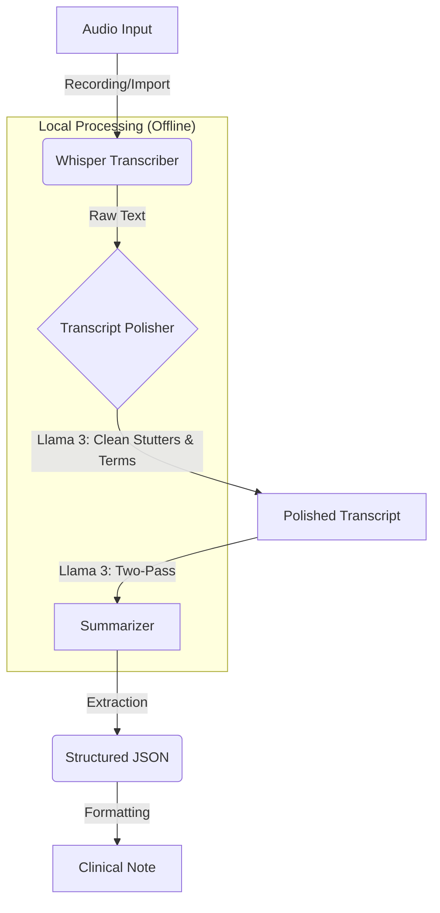

# GI Scribe Architecture

**GI Scribe** is a local-first, AI-powered medical dictation and summarization tool designed for Gastroenterologists. It records patient encounters, transcribes audio, corrects medical terminology, and generates structured clinical notes (HPI, Assessment, Plan).

## High-Level Pipeline

The system processes audio through a 3-stage pipeline to ensure maximum accuracy and clinical relevance.

## Core Components

### 1. Transcriber (`app/transcriber.py`)
*   **Engine:** `whisper.cpp` (C++ implementation of OpenAI Whisper).
*   **Model:** `large-v3` (Quantized to q5_0 or q8_0 for performance/accuracy balance).
*   **Feature:** Diarization (Speaker identification) using `whisperx` or simple heuristic mapping.
*   **Constraint:** Runs primarily on CPU/GPU depending on build; optimized for accuracy over speed.

### 2. Transcript Polisher (`app/transcript_polisher.py`)
*   **Engine:** `medllama3` (Llama 3 fine-tuned/prompted for medical context) via Ollama.
*   **Goal:** "Verbatim Correction".
*   **Logic:**
    *   Takes raw Whisper output (which may contain "womiting", phonetic errors).
    *   Preserves "stutters" (um, ah) to maintain accurate Word Error Rate (WER) alignment with ground truth (optional).
    *   Corrects only misspelled medical terms and severe grammar breaks.
    *   **Input:** "Patient has womiting and... uh... pain."
    *   **Output:** "Patient has vomiting and... uh... pain."

### 3. Summarizer (`app/two_pass_summarizer.py`)
*   **Engine:** `medllama3` via Ollama.
*   **Strategy:** "Divide and Conquer".
    *   **Pass 1 (Extraction):** Identifies key clinical entities (Symptoms, Meds, History) from the *Polished Transcript*.
    *   **Pass 2 (Synthesis):** Formats extraction into a standardized medical note (HPI, Findings, Assessment, Plan).
*   **Safety:** Zero-shot prompting with strict constraints to prevent hallucination (e.g., "If Plan is not spoken, write 'Not documented'").

## Data Storage

All data is stored locally in `root/local_storage/`:
*   `sessions/`: Metadata (`.json`), Audio (`.wav`), and Transcripts (`.txt`).
*   Retention policy manages auto-deletion of old files (default: 90 days).

## Directory Structure

*   `app/`: Core application logic (UI, Engines).
*   `data/`: Validation datasets (`GiAudiotest`, `GiTestValid`).
*   `models/`: Binary model files (GGML/GGUF).
*   `scripts/`: Utility scripts for benchmarking and maintenance.
*   `tests/`: Unit and integration tests.
*   `docs/`: User guides and developer documentation.

## Verification

To validate system performance:
*   **Full Pipeline:** `python scripts/validate_full_pipeline.py`
    *   Runs Transcribe -> Polish -> Summarize on `data/GiAudiotest`.
    *   Reports WER and Clinical Extraction Accuracy.
